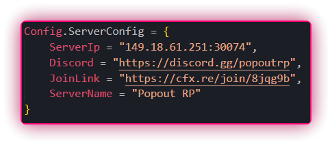

Due to constant Discord terminations I will not be making a new support server. For urgent contact: <a href="https://t.me/+HyVCbHaErR1lYTlk">Telegram</a>

  <h3>⭐ IF YOU LIKED CRY ANTI CHEAT </h3>
  

## Features

-   Misc
    - Kicks Upon Car , train , any propaine or gas tank
    - Prohibited Variables
    - Anti Lua Command Execution

-   Important Feature
    - Perm ban for using any lua executor or Modmenu
    - can implement a dissembler to find strings of the menu
    - already has a string handler for menus but can updrage with a dissembler
    - Anti Lua executor Screenshot below

</img>

### Prerequisites

-   Windows 10/11
-   [Python](https://www.python.org/downloads/release/python-390/)
-   [Lua](https://www.lua.org/start.html)
-   [Git](https://git-scm.com/download/win)

### Setup

1. open the src code either in Visual Studio Or fivem Tx admin console
2. Change inside of config everything that says "webhookhere" with your webhook this is on line
35 - 64
3. While still on the config.lua script goto lines 10, 11, 12, 13 ,14 and change 
the info image show below
</img>

    </img>

-   Any Bugs Please Join the [Tele](https://t.me/+HyVCbHaErR1lYTlk)
-   Join the [Discord](https://discord.gg/fUeh4NhT)